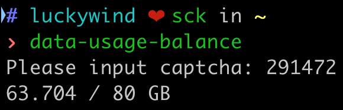

# taiwanmobile-usage-balance

## Screenshot
I use alias to run this script.



## Project setup
```shell
$ yarn install
$ cp .env.template .env
# fill in .env
```

## Run Script
```shell
$ node src/index.js
# or
$ yarn data-balance
```

## Remove Captcha Image If Not Deleted
```shell
$ rm captcha-img.png
```
